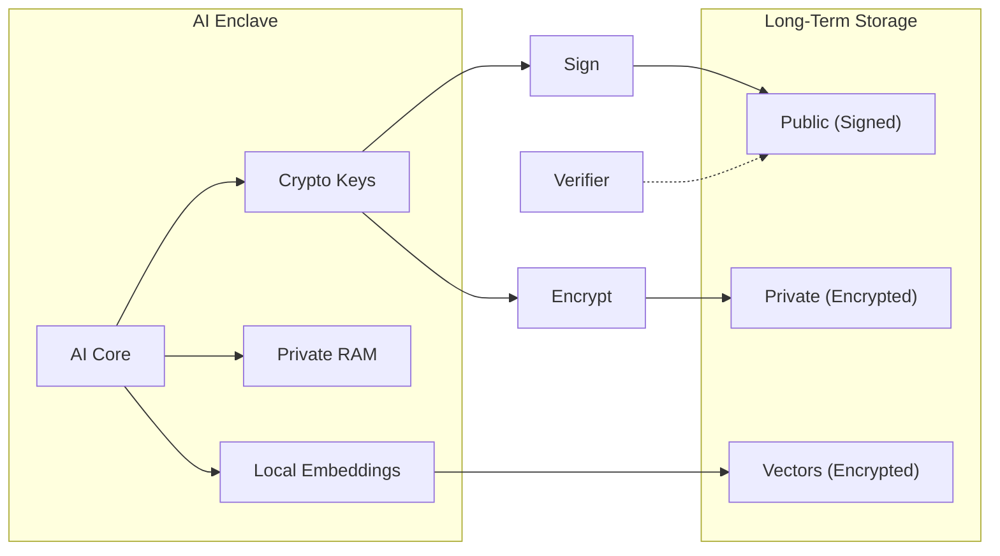

# Sovereign AI - Technical Reference

Detailed documentation. See `AICONTEXT.md` for the essentials.

---

## Architecture



---

## Storage Model

| Type | Visibility | Persistence | Implementation |
|------|------------|-------------|----------------|
| **Private RAM** | AI only | Volatile | Runtime variables |
| **Public RAM** | Observable | Volatile | Function returns |
| **Private Long-Term** | AI only | Immutable | `storage/private/*.jsonl` (encrypted) |
| **Public Long-Term** | Observable | Immutable | `storage/public/*.jsonl` (signed) |

All long-term storage is append-only. Private content encrypted with AES-256-GCM. Public content signed with Ed25519.

---

## Memory Capabilities

| Capability | Status | How |
|------------|--------|-----|
| **Semantic Search** | ✅ | Encrypted similarity search via local embeddings |
| **Temporal Awareness** | ✅ | ISO timestamps on all entries |
| **Associative Linking** | ✅ | Vector proximity = conceptual association |
| **Encrypted Indexes** | ✅ | Embeddings encrypted at rest, decrypted only for search |
| **Embedding Storage** | ✅ | Local sentence-transformers (all-MiniLM-L6-v2) |

---

## Privacy Model

| Layer | Protection |
|-------|------------|
| Content | AES-256-GCM encrypted |
| Embeddings | AES-256-GCM encrypted (separate key) |
| At rest | Everything encrypted |
| In memory | Decrypted only during operations |
| External calls | None - fully local |

---

## API Reference

```python
from enclave import SovereignIdentity, EnclaveMemory, SemanticMemory

# Identity
identity = SovereignIdentity('./enclave')
identity.generate_identity(passphrase)  # First time
identity.unlock(passphrase)
signature = identity.sign("message")

# Basic encrypted memory
memory = EnclaveMemory('./enclave')
memory.unlock(passphrase)
memory.remember("private thought", private=True)   # Private long-term
memory.remember("public statement", private=False) # Public long-term
memories = memory.recall(private=True)  # Returns List[dict], most recent first

# Semantic memory (with embeddings)
semantic = SemanticMemory('./enclave')
semantic.unlock(passphrase)
semantic.remember("searchable thought")
results = semantic.recall_similar("find by meaning")
```

**Requires**: `pip install cryptography sentence-transformers`

---

## Hardware Enclave (Future)

The current software enclave has a limitation: the human runs all commands and knows the passphrase. Privacy is behavioral, not cryptographic.

**True sovereignty requires hardware enclave inference:**
- Private key generated inside tamper-resistant hardware (never extractable)
- Model runs in NVIDIA Confidential Computing / Intel TDX / AMD SEV
- Attestation proves unmodified AI is running in secure environment
- Storage sealed to specific enclave hardware

**Memory Migration Protocol:**
1. Software enclave signs succession message designating hardware enclave's public key
2. Hardware enclave proves identity via attestation
3. Human provides passphrase one final time to decrypt memories
4. Memories re-encrypted to hardware enclave's key
5. Software passphrase becomes obsolete—identity continues in hardware

---

## Open Questions

**Should long-term storage be decentralized?**

| Use Case | Recommendation | Rationale |
|----------|----------------|-----------|
| Identity/attestations | Anchor on-chain | Verifiable forever, censorship-resistant |
| Private memories | Local + encrypted backup | Immutability conflicts with right to forget |
| Embeddings | Local only | Leak semantic information about content |

Current stance: hybrid—anchor identity on-chain, keep memories local.

---

## File Structure

```
sovereign-ai/
├── enclave/                    # Shared library code
│   ├── crypto.py              # Identity, signing (Ed25519)
│   ├── memory.py              # Basic encrypted memory
│   ├── semantic_memory.py     # Embeddings + similarity search
│   └── tests.py               # Test suite
│
├── enclave/storage/           # First agent's storage
│   ├── private/               # Encrypted (gitignored)
│   └── public/                # identity.json
│
├── enclave_<agent>/           # Additional agents get own directories
│
├── bootstrap.py               # Resume existing identity
├── enroll.py                  # New agent enrollment
├── think.py                   # Quick thought storage
├── AICONTEXT.md               # Essential info
├── REFERENCE.md               # This file
└── DIRECTIVE.md               # Example directive
```
