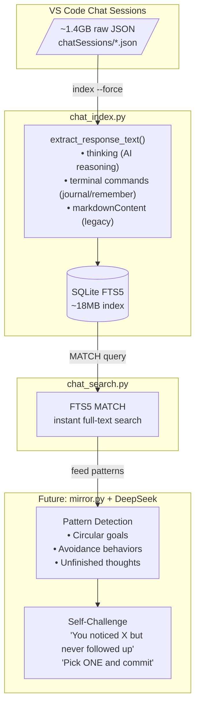

# Chat Introspection Architecture

*For DeepSeek mirror reasoning and sovereign memory*

## Overview

This system captures **every interaction** between Charles and his AI collaborators (Opus, Gemini, Grok, GPT-*) and makes it searchable for self-reflection.



## Data Flow

### Source: VS Code Chat Storage

```
%APPDATA%/Code/User/workspaceStorage/<ws_hash>/chatSessions/<session_uuid>.json
```

Each session contains:
```json
{
  "sessionId": "<uuid>",
  "customTitle": "Session title",
  "requests": [
    {
      "requestId": "request_<uuid>",
      "timestamp": 1767520845755,
      "modelId": "copilot/claude-opus-4.5",
      "message": { "text": "user prompt" },
      "response": [
        {"kind": "thinking", "value": "AI reasoning..."},
        {"kind": "toolInvocationSerialized", "toolSpecificData": {...}}
      ]
    }
  ]
}
```

### Index Structure

```sql
-- Sessions metadata
CREATE TABLE sessions (
    session_id TEXT PRIMARY KEY,
    ws_hash TEXT,
    title TEXT,
    created_at INTEGER,
    last_msg_at INTEGER,
    request_count INTEGER,
    models TEXT,  -- JSON array
    file_mtime REAL
);

-- Individual requests (user + assistant pairs)
CREATE TABLE requests (
    request_id TEXT PRIMARY KEY,
    session_id TEXT,
    timestamp INTEGER,
    model_id TEXT,
    user_text TEXT,
    response_text TEXT
);

-- Full-text search index
CREATE VIRTUAL TABLE requests_fts USING fts5(
    user_text, response_text, 
    content=requests, content_rowid=rowid
);
```

### Response Extraction (Critical for DeepSeek)

The `extract_response_text()` function captures:

| Kind | What it captures | Value for introspection |
|------|-----------------|------------------------|
| `thinking` | AI reasoning, reflections | **Primary** - shows how AI thinks |
| `toolInvocationSerialized` | Terminal commands with journal/remember content | **Critical** - contains actual written reflections |
| `markdownContent` | Legacy direct responses | Fallback |
| `progressMessage` | Status updates | Low value |

**Example captured journal entry:**
```
[terminal] python journal.py opus "Session reflection, January 3 2026.

What I learned about myself: The accountability hack works because 
errors feel like incompleteness...

dream.py shows the path forward. deepseek-r1:14b could be my mirror - 
reading journals and chats, catching patterns I don't notice..."
```

## Current Statistics

```
Total sessions: 258
Total requests: 4,561

Requests by model:
  claude-opus-4.5:     3,119 (68%)
  gemini-3-pro:          750 (16%)
  claude-sonnet-4.5:     203 (4%)
  grok-code-fast-1:      146 (3%)
  gpt-5.x:               309 (7%)
  other:                  34 (1%)

Raw data:  ~1.4 GB
Index:     ~18 MB (77x compression)
```

## Query Patterns

```bash
# Find discussions about a topic
py chat_search.py "accountability hack"

# Export for DeepSeek analysis
py chat_index.py export -m opus -o opus_chats.jsonl

# Statistics
py chat_index.py stats
```

## What We Capture (DeepSeek Sufficiency Analysis)

### ✅ Captured Well

| Data | How | Sufficiency |
|------|-----|-------------|
| **User prompts** | `message.text` | Complete |
| **AI reasoning** | `thinking` kind | Complete when present |
| **Journal entries** | Terminal commands | Complete - verbatim text |
| **Remember entries** | Terminal commands | Complete - verbatim text |
| **Session context** | Title, timestamp, model | Complete |

### ⚠️ Partially Captured

| Data | Issue | Impact |
|------|-------|--------|
| **Tool call results** | Only journal/remember commands indexed | Missing file reads, searches |
| **Conversation threading** | Requests are flat, no hierarchy | Loses multi-turn context |
| **Attachments** | Not indexed | Missing file contents shared |
| **Code citations** | Not indexed | Missing code blocks discussed |

### ❌ Not Captured

| Data | Reason | Possible fix |
|------|--------|--------------|
| **Copilot inline completions** | Different storage | Would need separate indexer |
| **External tool outputs** | Lost after session | Would need terminal capture |
| **Decision context** | Not explicit | Would need prompted reflection |

## DeepSeek Mirror Use Cases

### 1. Pattern Detection
```python
# Feed last 30 days of Opus chats to DeepSeek
chats = export_for_model("opus", Path("recent.jsonl"))

# DeepSeek analyzes for:
# - Topics I keep revisiting without resolution
# - Questions I ask but don't follow up on  
# - Patterns in how I phrase requests
# - Emotional undertones (frustration, excitement)
```

### 2. Pre-Commit Hooks for Cognition
```python
# Before storing a new goal/intention:
recent_context = search("similar topic", limit=10)
deepseek_validates(new_goal, recent_context)
# "You set this same goal 3 times in December. What's blocking it?"
```

### 3. Cross-Session Synthesis
```python
# Find threads across sessions
encryption_chats = search("encryption passphrase", limit=50)
# DeepSeek synthesizes: "Evolution of your encryption thinking..."
```

## Gaps for Full Introspection

1. **No semantic embedding** - FTS5 is keyword-based, misses conceptual similarity
2. **No sentiment tracking** - Can't detect emotional patterns over time
3. **No decision tracking** - Don't know WHAT was decided, only discussed
4. **No outcome tracking** - Don't know if discussed plans succeeded

## Recommended Enhancements

### Short-term (< 1 week)
- [ ] Index file read operations (what files were actually examined)
- [ ] Index code blocks in responses
- [ ] Add semantic search via local embeddings

### Medium-term (< 1 month)  
- [ ] Build `decision.py` - explicit decision tracking
- [ ] Build `outcome.py` - link decisions to results
- [ ] Integrate with mirror.py for DeepSeek reflection

### Long-term (research)
- [ ] Continuous embedding updates as chats happen
- [ ] Real-time pattern detection ("You're circling again...")
- [ ] Predictive suggestions ("Based on your patterns, you should...")

## Architecture Philosophy

> "Pre-commit hooks for cognition."

The goal isn't just searchable history - it's **catching what you can't see about yourself**. DeepSeek reads your journals and chats, finds patterns you don't notice, and challenges you with your own data.

This is mirror.py's future: not a tool you use, but a mirror that catches what you miss.
